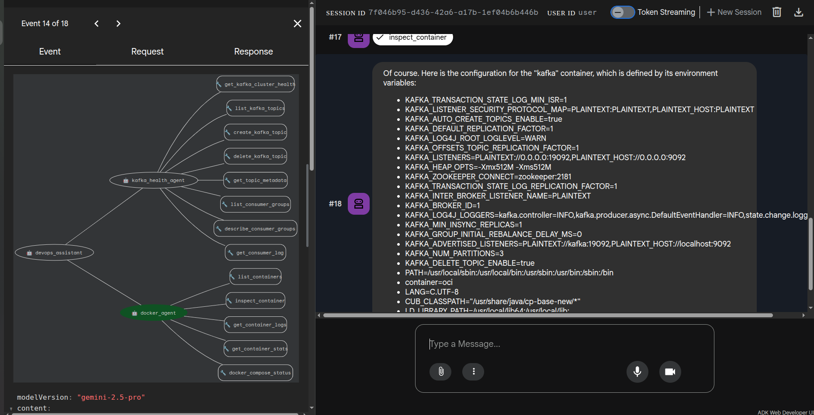

# AI Agents

A monorepo of autonomous AI agents built with [Google ADK](https://google.github.io/adk-docs/), managed as a [uv workspace](https://docs.astral.sh/uv/concepts/workspaces/).

## Repository Structure

```text
ai-agents/
├── pyproject.toml              # workspace root
├── docker-compose.yml          # shared infrastructure (Kafka, etc.)
├── core/                       # shared utilities (ai-agents-core)
│   ├── pyproject.toml
│   └── ai_agents_core/
│       ├── __init__.py
│       └── base.py             # create_agent(), load_agent_env()
└── agents/
    ├── kafka-health/           # Kafka monitoring agent
    │   ├── pyproject.toml
    │   └── kafka_health_agent/
    │       ├── __init__.py
    │       ├── agent.py
    │       └── tools.py
    └── devops-assistant/       # Multi-agent orchestrator
        ├── pyproject.toml
        └── devops_assistant/
            ├── __init__.py
            ├── agent.py        # root orchestrator + docker sub-agent
            └── docker_tools.py
```

## Agents

### kafka-health-agent

A single agent with tools for monitoring and managing a Kafka cluster: cluster health, topic CRUD, consumer group inspection, and lag calculation.

### devops-assistant (multi-agent)

An orchestrator that delegates to specialized sub-agents. It has no tools of its own — it routes user requests to the right specialist:

- **kafka_health_agent** — Kafka cluster operations (reused from the standalone agent above)
- **docker_agent** — Docker container listing, inspection, logs, stats, and Compose status



*The ADK Dev UI showing the agent graph: `devops_assistant` delegates to `kafka_health_agent` and `docker_agent`, each with their own tools. Here the docker agent inspects the Kafka container's configuration.*

## Prerequisites

- [uv](https://docs.astral.sh/uv/) for Python package management
- [Docker](https://docs.docker.com/get-docker/) for running infrastructure and the docker agent
- A Google Cloud Project with the Vertex AI API enabled (or an AI Studio API key)

## Getting Started

```bash
# Install all workspace packages
uv sync

# Start shared infrastructure (Kafka, Zookeeper, Kafka UI)
docker compose up -d
```

## Environment Configuration

Each agent expects a `.env` file in its package directory (e.g., `agents/kafka-health/kafka_health_agent/.env`):

```bash
# Using Vertex AI (Recommended)
GOOGLE_GENAI_USE_VERTEXAI=TRUE
GOOGLE_CLOUD_PROJECT=your-project-id
GOOGLE_CLOUD_LOCATION=your-region
GEMINI_MODEL_VERSION=gemini-2.0-flash

# OR using Google AI Studio
GOOGLE_GENAI_USE_VERTEXAI=FALSE
GOOGLE_API_KEY=your-api-key
```

Agent-specific variables (e.g., `KAFKA_BOOTSTRAP_SERVERS`) go in the same `.env` file.

## Running an Agent

From the agent's directory:

```bash
cd agents/kafka-health

# Launch the ADK Dev UI
uv run adk web

# Run in terminal
uv run adk run kafka_health_agent

# Start the API server
uv run adk api_server
```

For the devops-assistant:

```bash
cd agents/devops-assistant
uv run adk web
```

## Adding a New Agent

1. Create a directory under `agents/`:
   ```bash
   mkdir -p agents/my-agent/my_agent
   ```

2. Add a `pyproject.toml` that depends on `ai-agents-core`:
   ```toml
   [project]
   name = "my-agent"
   version = "0.1.0"
   requires-python = ">=3.11"
   dependencies = ["ai-agents-core"]

   [tool.uv.sources]
   ai-agents-core = { workspace = true }
   ```

3. Create `my_agent/__init__.py`:
   ```python
   from . import agent
   ```

4. Create `my_agent/agent.py`:
   ```python
   from ai_agents_core import create_agent, load_agent_env

   load_agent_env(__file__)

   root_agent = create_agent(
       name="my_agent",
       description="What this agent does.",
       instruction="How the agent should behave.",
       tools=[...],
   )
   ```

5. Register in the root `pyproject.toml` and run `uv sync`.
