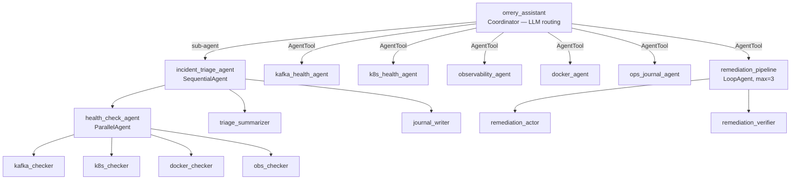

# Agentic Design Patterns Audit

This document analyzes the platform's architecture against the [Google Cloud Agentic Design Patterns](https://docs.cloud.google.com/architecture/choose-design-pattern-agentic-ai-system). The platform is classified as a **Hybrid Multi-Agent System** that balances deterministic workflows with dynamic LLM orchestration.

## Summary of Patterns

| Pattern Category | Key Patterns | Implementation in this Project |
| :--- | :--- | :--- |
| **Multi-Agent (MAS)** | Coordinator | `orrery_assistant` (Root Agent) uses `AgentTool` to route requests. |
| | Sequential | `incident_triage_agent` runs a fixed pipeline: Triage → Summarize → Save. |
| | Parallel | `health_check_agent` runs K8s, Kafka, and Docker checks concurrently. |
| | Hierarchical | Root Orchestrator → Workflow Agents → Specialist Workers. |
| **Iterative & Feedback** | ReAct | Default behavior for all `LlmAgent` instances (Thought/Action/Observation). |
| | Loop / Refinement | `LoopAgent` remediation loop: act → verify → retry (AEP-004). |
| | Generator/Critic | Evaluation framework uses LLM-as-a-judge (AEP-002). |
| **Specialized** | Human-in-the-Loop | `GuardrailsPlugin` gates tools with `@confirm` and `@destructive`. |
| | Custom Logic | Enforced via `SequentialAgent` and `ParallelAgent` factory functions. |

## Composition at a Glance

Deterministic workflows (triage, remediation) live under `sub_agents` —
their execution order is fixed. Specialists live behind `AgentTool` so
the root LLM picks them based on the user's intent. See
[ADR-002](adr/002-agent-tool-vs-sub-agents.md) for the rationale.

---

## Detailed Analysis

### 1. Multi-Agent Systems (MAS)

The project leverages the **Coordinator Pattern** as its primary entry point. The root `orrery_assistant` does not perform technical tasks itself; instead, it analyzes user intent and delegates to specialized agents.

*   **LLM-Driven Routing (AgentTool):** As defined in [ADR-002](adr/002-agent-tool-vs-sub-agents.md), specialists like `kafka_agent` and `k8s_agent` are exposed as tools. The LLM decides when to invoke them based on their descriptions.
*   **Deterministic Workflows (Sub-agents):** For complex, repeatable tasks like incident triage, the system switches to **Sequential** and **Parallel** patterns. The `incident_triage_agent` ensures that all systems are checked simultaneously before a summary is generated, providing a predictable and high-quality output that pure LLM routing might miss.

### 2. Iterative & Feedback Patterns

Every individual agent in the project follows the **ReAct (Reason and Act)** pattern. When an agent is given a task, it iterates through "Thoughts" and "Actions" (tool calls) until it observes enough information to provide a final response.

**Iterative Refinement** is implemented in the remediation layer ([AEP-004](enhancements/aep-004-loop-agent-remediation.md)). The `LoopAgent`-based `remediation_pipeline` implements a **closed-loop remediation** pattern:

1.  **Act**: The `remediation_actor` attempts a fix (restart, scale, or rollback a deployment).
2.  **Verify**: The `remediation_verifier` checks system health using diagnostic tools.
3.  **Decide**: If resolved, the verifier calls `exit_loop` (sets `escalate = True`). If still failing, the loop retries with a different action — up to 3 iterations.

The `remediation_pipeline` is exposed as an `AgentTool` on the root orchestrator, so the user can trigger it after a triage with "fix it" or "auto-remediate".

### 3. Specialized Patterns

The platform implements a robust **Human-in-the-Loop** pattern via the `GuardrailsPlugin`. 
*   **Safety Gating:** Tools marked with `@confirm` or `@destructive` decorators are intercepted by the `before_tool_callback`.
*   **Bypass Prevention:** The system uses an arguments-hash and invocation-ID tracking mechanism to ensure that the agent only proceeds if the user has explicitly provided confirmation for the *exact* operation requested.

---

## Best Practices: Sizing Tools & Agents

Agentic systems degrade gracefully in capability but sharply in *tool selection accuracy*
as the tool/agent surface grows. The numbers below are the budgets this project targets,
with the reasoning behind each.

### Tool count per agent

| Budget | Value | Rationale |
| :--- | :--- | :--- |
| Sweet spot | **5–15 tools** | LLM function-calling accuracy stays near ceiling. |
| Soft ceiling | **~20 tools** | Measurable accuracy drop on frontier models (see benchmarks below). |
| Hard ceiling | **~25 tools** | Tool-selection errors dominate; eval scores collapse. |

**Why it matters:**

- **Accuracy degradation.** Public benchmarks — the [Berkeley Function-Calling
  Leaderboard (BFCL)](https://gorilla.cs.berkeley.edu/leaderboard.html),
  [Gorilla](https://gorilla.cs.berkeley.edu/), and
  [ToolBench/τ-bench](https://github.com/sierra-research/tau-bench) — consistently show that
  tool-selection accuracy drops as tool count grows, especially when tool descriptions are
  semantically similar (e.g. `get_pod_logs` vs. `describe_pod` vs. `get_pod_events`).
- **Context tax.** Every tool schema is serialised into the system prompt on every turn.
  30 tools × ~150 tokens ≈ 4.5k tokens before the user has spoken. That also churns the
  prompt-cache key and erases the gains documented in [AEP-007](enhancements/aep-007-context-caching.md).
- **Eval combinatorics.** Each tool *pair* is a potential wrong-tool failure mode. 10 tools → 45
  pairs; 30 tools → 435 pairs. Eval coverage (AEP-002) gets expensive fast.

**Current state in this project:**

| Agent | Tools | Status |
| :--- | :--- | :--- |
| `kafka_health_agent` | 4–8 | ✅ in sweet spot |
| `k8s_health_agent` | 11–12 | ✅ in sweet spot |
| `docker_agent` | 3–5 | ✅ in sweet spot |
| `observability_agent` | 4 | ✅ in sweet spot |
| `ops_journal_agent` | 2 | ✅ in sweet spot |

### Agent count per orchestrator

| Budget | Value | Rationale |
| :--- | :--- | :--- |
| Sweet spot | **3–7 direct children** | Routing is tool-selection in disguise; same limits apply. |
| Hard ceiling | **~10 direct children** | Misrouting becomes the dominant eval failure. |

The `orrery_assistant` root currently exposes **6 AgentTools + 1 sub-agent** — right in
the pocket. Adding a 7th specialist should retire or merge an existing one.

### Hierarchy depth

- **Keep it shallow: 2–3 levels.** Each level = one extra LLM turn = added latency (~1–3 s),
  added token cost (context re-summarisation), and a new routing failure mode.
- Current project depth: 3 (`root → triage → health_check → specialist_checker`). That is
  the ceiling, not a floor to exceed.

### When to split an agent

Split when **any** of these holds:

1. Tool count crosses **~15**.
2. Tools span **different privilege tiers** (viewer / operator / admin) — splitting
   mirrors RBAC cleanly (see [ADR-001](adr/001-rbac.md)).
3. Tools touch **different external systems** with distinct failure modes — per-system
   circuit breakers ([resilience](https://github.com/BAHALLA/orrery/blob/main/core/orrery_core/resilience.py)) work better when
   isolated.
4. The system prompt starts containing *"if the user asks X use tool Y; if Z use tool W"* —
   that routing belongs in sub-agent selection, not prose.
5. A tool group **drags down the eval score** — isolate and iterate.

### When NOT to split

- Three tools always called together don't need their own agent.
- "Separation of concerns": agents are not microservices. Every extra agent adds one LLM
  turn on the critical path.
- A tool invoked once per session — keep it on the parent.

### Signals you've overgrown

- Orchestrator chooses the wrong sub-agent in **>5 %** of eval runs.
- p95 latency per user turn > **10 s** because of multi-level routing.
- Context-cache hit rate trending down (tool/agent churn).
- Prose disambiguation creeping into the system prompt.

---

## Framework & Model Limits

Know where the ceiling is imposed by the model or the framework, not by your design.

### Model-level limits

| Model family | Hard tool-list cap | Practical cap (per public benchmarks / vendor guidance) |
| :--- | :--- | :--- |
| **Gemini 2.x / 2.5** | 128 function declarations per request | Accuracy drops past ~20; keep ≤15 for parallel tool calls. |
| **Claude (Sonnet/Opus 4.x)** | No hard documented cap; limited by context window (200k) | Anthropic's tool-use guide recommends keeping tool count "small"; descriptions matter more than count. |
| **OpenAI (GPT-4.x / o-series)** | 128 tools per request (documented) | Function-calling quality degrades past ~20 similar tools. |
| **Ollama / local models** | Varies; most open models degrade sharply past ~10 tools | Strict budget ≤10; prefer narrow specialists. |

**Implication for multi-provider operation:** because this project supports
`MODEL_PROVIDER` switching via LiteLLM, **design to the tightest cap you might deploy
against** — currently Ollama. A 10-tool budget per agent is a safe floor that works on
every supported provider.

### Framework-level limits (ADK)

- **No hard numeric cap** on tools or sub-agents — ADK delegates these limits to the
  underlying model.
- **`LoopAgent`** should always set `max_iterations`. This project uses `3` (see
  [AEP-004](enhancements/aep-004-loop-agent-remediation.md)). There is no default safety
  net.
- **`ParallelAgent` fan-out** is bounded only by your Python asyncio thread pool and the
  downstream systems' concurrency limits. Add per-system semaphores where relevant.
- **`session.state`** is a dict shared across agents in a run. It is not size-limited by
  ADK, but large payloads here bloat every subsequent LLM call. Prefer `output_key` with
  small summaries over dumping raw tool output.
- **Plugins apply globally** on the `Runner`. There is no per-agent plugin scoping — keep
  plugins cheap because they run on every tool call.

### Context-window budgeting

Plan the system prompt so that, at steady state:

- Tool schemas **< 10 %** of context window.
- Session state + activity log **< 20 %**.
- Conversation history **< 40 %**.
- Leave **≥ 30 %** headroom for the user turn + tool results + model output.

If any of those is breached, it's a sign to split the agent, summarise state, or enable
context caching ([AEP-007](enhancements/aep-007-context-caching.md)) where the provider
supports it (Gemini today).

---

## When to Reach for A2A (Scaling Across Processes)

The in-process model (sub-agents + `AgentTool`) is the right default. Reach for the
**A2A protocol** (see [AEP-005](enhancements/aep-005-a2a-protocol.md)) only when one of the
following is true — not to feel more "distributed":

1. **Independent deployment cadence.** A team needs to ship the Kafka agent without
   redeploying the orchestrator (or vice versa).
2. **Independent scaling.** One agent's load profile is radically different from the
   rest — e.g. a log-analysis agent that wants 10× replicas while the orchestrator is
   fine on one.
3. **Cross-language agents.** A Go or Java specialist needs to plug into the Python
   orchestrator.
4. **Cross-org reuse.** Another platform wants to consume one of your agents without
   importing Python code.
5. **Blast-radius isolation.** An agent touches systems that warrant a separate security
   boundary (separate IAM, separate network segment, separate audit stream).
6. **Resource isolation.** An agent has a heavy native dependency (e.g. a vendored
   binary, a large ML model) that shouldn't live inside the orchestrator image.

### When NOT to use A2A

- **To make the system "more microservice-like".** Each hop adds network latency, a new
  failure mode, and an extra serialisation boundary for tool results.
- **For performance.** A2A is strictly slower than in-process calls. It buys deployment
  flexibility, not speed.
- **Before evals exist.** Without the eval harness (AEP-002) you cannot prove the split
  didn't regress behaviour.
- **For one-off fan-out.** If you need parallel tool calls, `ParallelAgent` already gives
  you that without a network hop.

### Scaling playbook

| Scale stage | Pattern | Typical trigger |
| :--- | :--- | :--- |
| Single process | `AgentTool` + `sub_agents` (today) | ≤ a few hundred QPS, one team. |
| Single process, horizontally replicated | Same, behind a load balancer with shared session store | State isolation + stateless agents. |
| A2A per agent | `A2AServer` / `RemoteA2aAgent` (AEP-005) | Independent deploy, scale, or ownership. |
| A2A + async bus | A2A + Pub/Sub for long-running work (see google-chat-bot worker) | Work exceeds HTTP timeouts; needs retry/DLQ semantics. |

Each step up adds operational surface area — take it only when the prior step can't
absorb the load or organisational constraint.

---

## References

*   [Google Cloud: Choose a design pattern for an agentic AI system](https://docs.cloud.google.com/architecture/choose-design-pattern-agentic-ai-system)
*   [A2A Protocol specification](https://a2a-protocol.org)
*   [Berkeley Function-Calling Leaderboard (BFCL)](https://gorilla.cs.berkeley.edu/leaderboard.html)
*   [Gorilla: Large Language Model Connected with Massive APIs](https://gorilla.cs.berkeley.edu/)
*   [τ-bench (ToolBench)](https://github.com/sierra-research/tau-bench)
*   [ADR-001: RBAC via Guardrail Metadata](adr/001-rbac.md)
*   [ADR-002: AgentTool vs Sub-Agents](adr/002-agent-tool-vs-sub-agents.md)
*   [AEP-002: Agent Evaluation Framework](enhancements/aep-002-agent-evaluation.md)
*   [AEP-004: LoopAgent for Self-Healing](enhancements/aep-004-loop-agent-remediation.md)
*   [AEP-005: A2A Protocol Support](enhancements/aep-005-a2a-protocol.md)
*   [AEP-007: Context Caching](enhancements/aep-007-context-caching.md)
