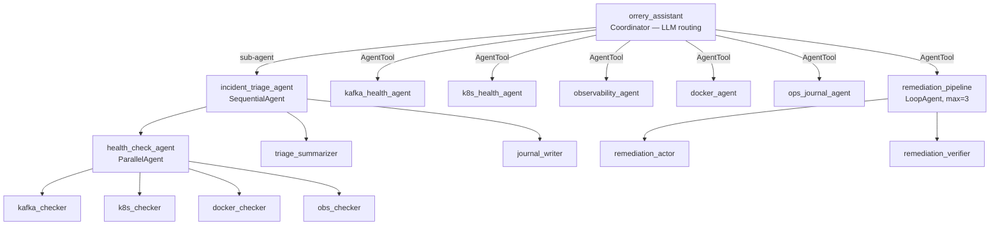

# Agentic Design Patterns Audit

This document analyzes the platform's architecture against the [Google Cloud Agentic Design Patterns](https://docs.cloud.google.com/architecture/choose-design-pattern-agentic-ai-system). The platform is classified as a **Hybrid Multi-Agent System** that balances deterministic workflows with dynamic LLM orchestration.

## Summary of Patterns

| Pattern Category | Key Patterns | Implementation in this Project |
| :--- | :--- | :--- |
| **Multi-Agent (MAS)** | Coordinator | `orrery_assistant` (Root Agent) uses `AgentTool` to route requests. |
| | Sequential | `incident_triage_agent` runs a fixed pipeline: Triage → Summarize → Save. |
| | Parallel | `health_check_agent` runs K8s, Kafka, and Docker checks concurrently. |
| | Hierarchical | Root Orchestrator → Workflow Agents → Specialist Workers. |
| **Iterative & Feedback** | ReAct | Default behavior for all `LlmAgent` instances (Thought/Action/Observation). |
| | Loop / Refinement | `LoopAgent` remediation loop: act → verify → retry (AEP-004). |
| | Generator/Critic | Evaluation framework uses LLM-as-a-judge (AEP-002). |
| **Specialized** | Human-in-the-Loop | `GuardrailsPlugin` gates tools with `@confirm` and `@destructive`. |
| | Custom Logic | Enforced via `SequentialAgent` and `ParallelAgent` factory functions. |

## Composition at a Glance

Deterministic workflows (triage, remediation) live under `sub_agents` —
their execution order is fixed. Specialists live behind `AgentTool` so
the root LLM picks them based on the user's intent. See
[ADR-002](adr/002-agent-tool-vs-sub-agents.md) for the rationale.

---

## Detailed Analysis

### 1. Multi-Agent Systems (MAS)

The project leverages the **Coordinator Pattern** as its primary entry point. The root `orrery_assistant` does not perform technical tasks itself; instead, it analyzes user intent and delegates to specialized agents.

*   **LLM-Driven Routing (AgentTool):** As defined in [ADR-002](adr/002-agent-tool-vs-sub-agents.md), specialists like `kafka_agent` and `k8s_agent` are exposed as tools. The LLM decides when to invoke them based on their descriptions.
*   **Deterministic Workflows (Sub-agents):** For complex, repeatable tasks like incident triage, the system switches to **Sequential** and **Parallel** patterns. The `incident_triage_agent` ensures that all systems are checked simultaneously before a summary is generated, providing a predictable and high-quality output that pure LLM routing might miss.

### 2. Iterative & Feedback Patterns

Every individual agent in the project follows the **ReAct (Reason and Act)** pattern. When an agent is given a task, it iterates through "Thoughts" and "Actions" (tool calls) until it observes enough information to provide a final response.

**Iterative Refinement** is implemented in the remediation layer ([AEP-004](enhancements/aep-004-loop-agent-remediation.md)). The `LoopAgent`-based `remediation_pipeline` implements a **closed-loop remediation** pattern:

1.  **Act**: The `remediation_actor` attempts a fix (restart, scale, or rollback a deployment).
2.  **Verify**: The `remediation_verifier` checks system health using diagnostic tools.
3.  **Decide**: If resolved, the verifier calls `exit_loop` (sets `escalate = True`). If still failing, the loop retries with a different action — up to 3 iterations.

The `remediation_pipeline` is exposed as an `AgentTool` on the root orchestrator, so the user can trigger it after a triage with "fix it" or "auto-remediate".

### 3. Specialized Patterns

The platform implements a robust **Human-in-the-Loop** pattern via the `GuardrailsPlugin`. 
*   **Safety Gating:** Tools marked with `@confirm` or `@destructive` decorators are intercepted by the `before_tool_callback`.
*   **Bypass Prevention:** The system uses an arguments-hash and invocation-ID tracking mechanism to ensure that the agent only proceeds if the user has explicitly provided confirmation for the *exact* operation requested.

---

## References

*   [Google Cloud: Choose a design pattern for an agentic AI system](https://docs.cloud.google.com/architecture/choose-design-pattern-agentic-ai-system)
*   [ADR-002: AgentTool vs Sub-Agents](adr/002-agent-tool-vs-sub-agents.md)
*   [AEP-004: LoopAgent for Self-Healing](enhancements/aep-004-loop-agent-remediation.md)
