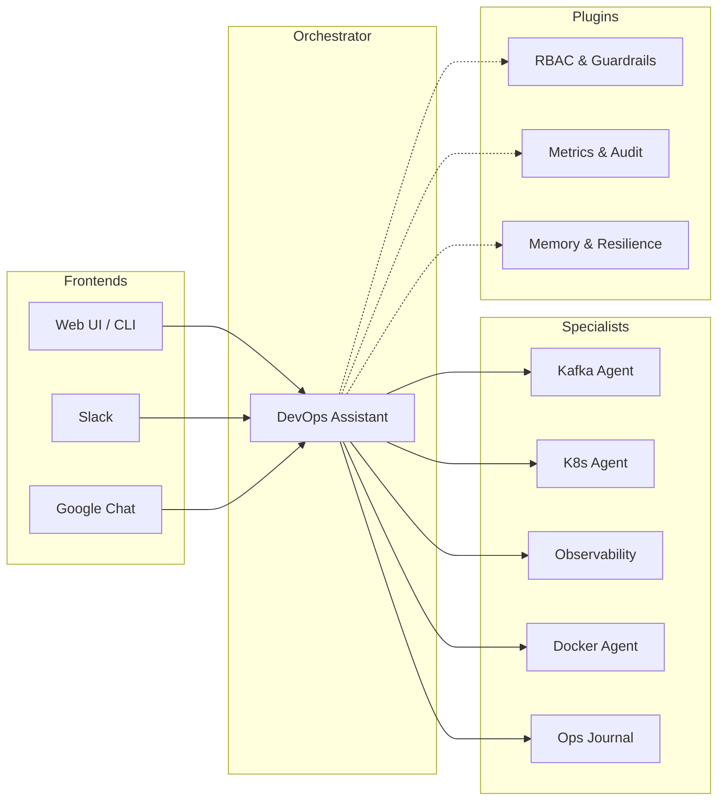

# 🤖 AI Agents for DevOps & SRE

Welcome to the documentation for the **AI Agents** platform — an open-source framework for building autonomous DevOps and SRE agents. Built with [Google ADK](https://google.github.io/adk-docs/) and managed as a [uv workspace](https://docs.astral.sh/uv/).

---

## 🏗️ Architecture Overview

The platform follows a **Coordinator-Specialist** pattern. A root orchestrator analyzes user intent and delegates to specialized agents. Cross-cutting concerns like safety, observability, and resilience are handled globally via a plugin system.

### 🧠 Core Philosophy
1.  **Safety First:** No destructive tool executes without verified human confirmation.
2.  **Autonomous Investigation:** Agents run diagnostics in parallel, mimicking an SRE's thought process.
3.  **Closed-Loop Remediation:** Actions are always followed by verification and retry loops.
4.  **Observable by Design:** Every interaction is instrumented with Prometheus metrics and audit logs.

---

## 📂 Project Structure

| Component | Path | Description |
|-----------|------|-------------|
| [**core**](core/README.md) | `core/` | Shared library: agent factories, plugin system, validation, and base configurations. |
| [**agents**](agents/devops-assistant.md) | `agents/` | Specialist agent implementations (Kafka, K8s, Docker, etc.). |
| [**infra**](config/general.md#infrastructure) | `infra/` | Local diagnostic stack (Prometheus, Loki, Kafka, Grafana). |
| [**docs**](adr/001-rbac.md) | `docs/` | Architectural Decision Records (ADR) and Enhancement Proposals (AEP). |

---

## 🛠️ Key Capabilities

??? info "Multi-Agent Orchestration"
    The root agent uses **AgentTool** for dynamic routing and **Sub-agents** for fixed workflows like incident triage. [Read ADR-002](adr/002-agent-tool-vs-sub-agents.md) for details.

??? info "RBAC & Safety"
    A 3-role hierarchy (**Viewer/Operator/Admin**) derived automatically from tool decorators. Destructive operations are gated by a secure confirmation flow. [Read ADR-001](adr/001-rbac.md).

??? info "Self-Healing Remediation"
    Implementation of the `LoopAgent` pattern: Act → Verify → Retry. Agents can automatically fix common issues found during triage. [Read AEP-004](enhancements/aep-004-loop-agent-remediation.md).

??? info "Cross-Session Memory"
    Uses ADK's Memory Service with a security layer to redact PII before persisting sessions. [Learn about Memory](memory.md).

---

## 🚀 Getting Started

1.  **[Quick Start](getting-started.md)** — Launch the platform in 5 minutes using Docker.
2.  **[Configuration](config/general.md)** — Set up your LLM provider (Gemini, Claude, OpenAI).
3.  **[Slack Integration](integrations/slack.md)** — Connect your agents to your team's workspace.
4.  **[Developer Guide](adding-an-agent.md)** — Build your own specialist agents.
