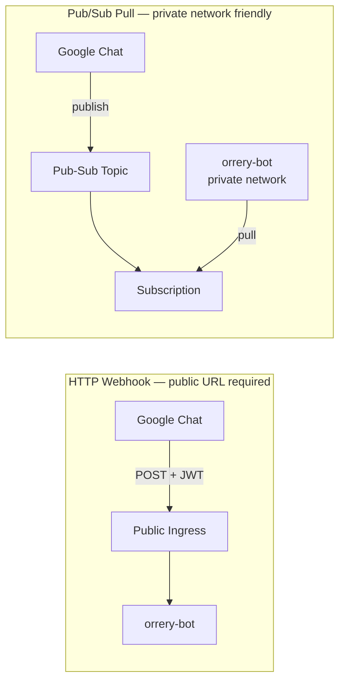

# Google Chat Bot Integration

{ align=right width="400" }

The Orrery platform ships a Google Chat integration that supports **thread-based session isolation**, **email-based RBAC**, and **interactive Card v2 Approve/Deny flows** for guarded tools.

Google Chat supports two ways of connecting to your bot. Choose the one that best fits your infrastructure:



<div class="grid cards" markdown>

-   :material-webhook:{ .lg .middle } __[HTTP Webhook Setup](google-chat-webhook.md)__

    ---

    Standard connection for bots with a public URL (Ingress, Cloud Run, ngrok). Lowest latency.

-   :material-swap-horizontal:{ .lg .middle } __[Pub/Sub Setup](google-chat-pubsub.md)__

    ---

    Ideal for private networks (GKE). Bot pulls events from a queue; no public ingress required.

</div>

---

## Shared Concepts

Regardless of the transport you choose, the following concepts apply to all Google Chat deployments.

### Async Response Mode

Google Chat enforces a **~30 second synchronous budget** on webhook responses. If an agent run exceeds this budget, the UI will show an error. Orrery solves this with **Async Response Mode**:

1.  **Immediate Ack**: The bot returns a `200 OK` (empty `hostAppDataAction`) immediately.
2.  **Progress card posted**: A live "🔍 Investigating…" Card v2 is posted to the thread via the Chat REST API.
3.  **Background run**: The agent run proceeds. As sub-agents report in, the bot **PATCHes the same card in place** (`spaces.messages.patch` with `updateMask=cardsV2`) — no thread spam.
4.  **Final result**: On completion, the progress card is replaced with the final reply (see *Progressive Cards* below).

This mode is enabled by default (`GOOGLE_CHAT_ASYNC_RESPONSE=true`).

### Progressive Cards

For long-running investigations (incident triage, remediation loops), the bot streams progress live by updating a single message in place. The user sees the run evolve instead of staring at a blank thread for 60–120s.

**What the progress card shows:**

-   **Current step** — the friendly label for the executing sub-agent (e.g. `Checking Kafka`, `Synthesizing findings`).
-   **Tool breadcrumb** — the most recent tool call (`list_consumer_groups`, `get_pods`, …) so operators can see what the agent is doing right now.
-   **Subsystem chips** — one row per health-check subsystem that has reported in, with a severity icon inferred from the status text:
    -   ✅ `ok` · ⚠️ `warn` (yellow/degraded/lag) · ❌ `fail` (red/critical/crashloop) · ⏳ `pending`
-   **Remediation panel** (when `remediation_pipeline` is running) — shows `remediation_action` → `verification_result` → `remediation_summary` as the `LoopAgent` iterates.
-   **Elapsed seconds** — visible forward-progress signal.

Card updates are **debounced at 800ms** and **force-flushed** on each subsystem status write to balance liveness against Chat's update quota.

**Final result card (triage runs):**

When the run writes `kafka_status` / `k8s_status` / `docker_status` / `observability_status` / `elasticsearch_status` / `triage_report` into session state (i.e. `incident_triage_agent` ran), the progress card is replaced with a structured **Triage Report** card:

-   **Header** — overall severity badge: 🟢 *All systems healthy* / 🟡 *Degraded* / 🔴 *Critical*.
-   **Subsystem sections** — one section per subsystem with an icon and short summary.
-   **Summary** — the `triage_summarizer` output.
-   **"Run Remediation" button** — fires the `remediation_pipeline` in the same session, reusing the triage report. Rendered **only** when overall severity is `warn` or `fail` **and** the clicker is an `operator` or `admin` (RBAC is still enforced server-side at tool time — the button is just a UI convenience).

For non-triage queries (e.g. *"what's the Kafka lag?"*), no subsystem chips land, so the progress card falls back to a plain text/markdown final reply and the *Run Remediation* button is not shown.

**Failure modes handled:**

-   If `update_message` hits 404/410 (message deleted), subsequent updates are skipped silently.
-   If a later update fails for another reason, the final reply falls back to a fresh `create_message` so the user still gets a result.
-   If the agent run raises, the progress card is overwritten with an error card — never left stuck on "Investigating…".

### Authentication for Async Replies

Posting async replies requires a credential bearing the `https://www.googleapis.com/auth/chat.bot` scope.

-   **Local Dev**: You **must** use a Service Account JSON key. `gcloud auth login` cannot obtain this scope.
-   **Production (GKE)**: Use **Workload Identity**. Leave `GOOGLE_CHAT_SERVICE_ACCOUNT_FILE` unset and the bot will use ADC.

```bash
# Required for local dev
GOOGLE_CHAT_SERVICE_ACCOUNT_FILE=/path/to/key.json
```

### Role-Based Access Control (RBAC)

Identity is resolved from the user's verified email address.

| Role | Access | How to grant |
|------|--------|--------------|
| `viewer` | Read-only tools | Default |
| `operator` | Read + `@confirm` tools | Add email to `GOOGLE_CHAT_OPERATOR_EMAILS` |
| `admin` | All tools | Add email to `GOOGLE_CHAT_ADMIN_EMAILS` |

### Interactive Guardrails

When an agent attempts a tool marked `@confirm` or `@destructive`, the bot posts a **Card v2** with **Approve** and **Deny** buttons. Execution pauses until a human clicks a button.

---

## Workspace Add-ons Mode

If your bot is a **Google Workspace Add-on**, it uses a different event structure and requires response wrapping. Orrery detects this automatically and uses the `hostAppDataAction` schema.

!!! note "Service Agent Identity"
    Add-on tokens are signed by a project-specific service agent. Add it to your `.env`:
    `GOOGLE_CHAT_IDENTITIES=chat@system.gserviceaccount.com,service-<PROJECT_NUMBER>@gcp-sa-gsuiteaddons.iam.gserviceaccount.com`

---

## Troubleshooting

-   **401 Unauthorized**: Check your `GOOGLE_CHAT_AUDIENCE` (must match console exactly) and `GOOGLE_CHAT_IDENTITIES`.
-   **403 Forbidden**: Your Service Account lacks the "Chat Bot API" or the `chat.bot` scope.
-   **404 Not Found**: The bot couldn't resolve the space name from the event.
